이 프로젝트는 패션 도메인에서 이미지-이미지 검색을 위한 것이다. 일반적인 유사 이미지 검색과 다르게, 이미지에서 패션 아이템을 탐지하는 기능과 탐지된 패션 아이템의 임베딩을 추출해야 하는 부분 두 가지가 필요하다(사실 학습 데이터 자동 라벨링을 위한 모델도 추가적으로 필요). 보통의 유사 이미지 검색은 일반적인 도메인에서 사전학습된 오픈소스 모델로도 어느정도의 성과 달성이 가능하다. 그러나 패션 도메인에서는 파인튜닝이 필수적인데, 데이터셋의 부족으로 쉽지 않다. 이 프로젝트에서는 객체 탐지 및 임베딩 추출 모델을 학습시키는 네트워크 및 방법에 관련된 내용을 기록하는 것이 목적이다. 사실상 훈련 데이터 수집/전처리/라벨링 단계가 task의 90% 이상을 차지한다. 이 프로젝트의 목적은 단순 토이 프로젝트에서 그치지 않고 통상적인 온라인 패션 커머스에서 바로 사용 가능한 수준의 훈련된 모델을 만드는 것이다.(물론 서비스별로 상품 썸네일 특성, 유저의 쿼리 이미지 형태가 다를 수 있으므로 최적화된 데이터셋을 구성하여 서비스에 최적화 된 모델을 훈련하는 것이 최선이다.)

객체탐지 모델과 카테고리 분류기 학습 데이터셋은 직접 웹에서 수집/전처리 하였고 혹시모를 라이센스 문제로 공개하지 않는다.

# 1. 훈련 데이터

### 1) 객체 탐지(object detection)

- [modanet](https://github.com/eBay/modanet)

  객체 탐지 모델 파인튜닝을 위한 데이터셋. 성능을 위해 카테고리를 bag, bottom, dress, hat, outer, shoes, top 7개로 통합.

- [fashionpedia](https://fashionpedia.github.io/home/)

  객체 탐지 모델 파인튜닝을 위한 데이터셋. 마찬가지로 카테고리를 bag, bottom, dress, hat, outer, shoes, top 7개로 통합.

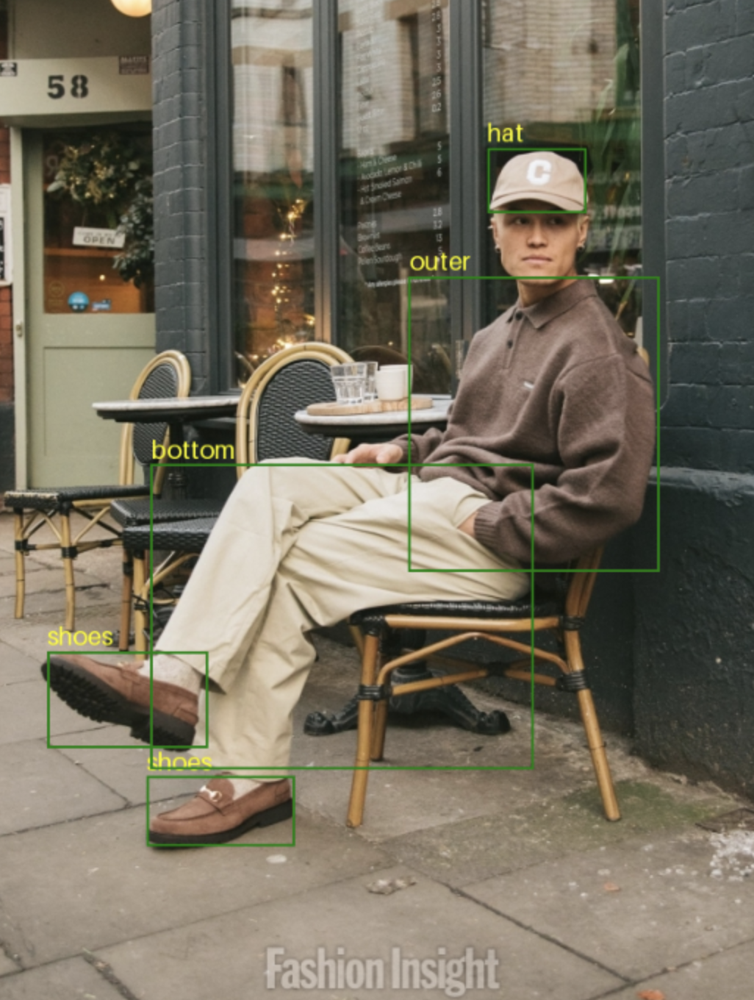

학습의 편의를 위해 이 데이터들은 가공한 후, 합쳐서 하나의 huggingface dataset 포맷으로 변환해서 사용했다.

### 2) 이미지 인코더

- [onthelook](https://onthelook.co.kr/)을 크롤링하여 수집하고 전처리를 했다. 유저가 업로드한 post에서 이미지 - 상품 썸네일 조합의 raw 데이터를 먼저 수집하였다. 이후 스타일 이미지에 대해 객체탐지를 수행하고 상품 썸네일에 대해 카테고리 분류를 수행하여 같은 카테고리끼리 이미지 쌍으로 묶었다. (카테고리 분류기는 [29cm](https://29cm.co.kr/) 상품 리스트 페이지에서 썸네일과 카테고리 정보를 수집 후 학습시켰음.)

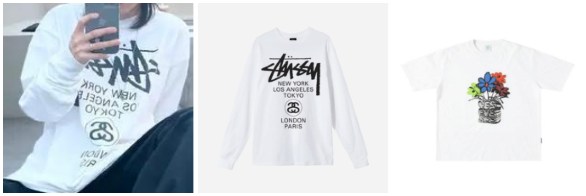
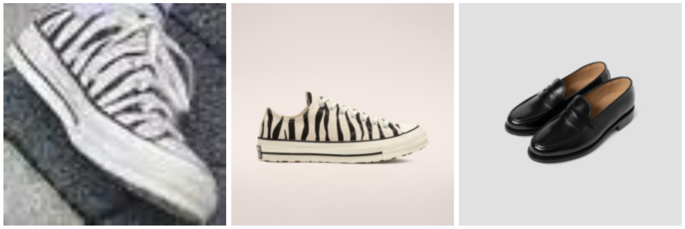

학습의 편의를 위해 최종적으로는 huinggface dataset 포맷으로 변환해서 사용했다.

</br>

> 추가로 [deepfasion2](https://github.com/switchablenorms/DeepFashion2), [k-fashion 데이터](https://github.com/K-COORD/K-Fashion), [fashion anchor cloth pairs](https://www.kaggle.com/datasets/kritanjalijain/fashion-anchor-cloth-pairs) 같은 공개된 데이터셋도 있지만 카테고리 종류가 별로 없거나, 스튜디오 에서 찍은 노이즈 없는 이미지라 현실과의 괴리가 있거나 하는 등의 부족함이 있어 사용하지 못했다.

<br>

# 2. 네트워크 구조

### 1) 객체 탐지

[microsoft/conditional-detr-resnet-50](https://huggingface.co/microsoft/conditional-detr-resnet-50)
객체 탐지는 vision 분야의 대표적인 이미지 task 중 하나로 데이터셋 포맷이 꽤 정형화 되어 있음. huggingface에서 제공하는 task guide만 참고하여도 충분히 쉽게 학습/추론이 가능하다.

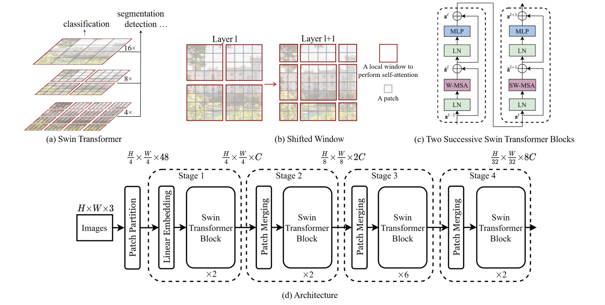

### 2) 이미지 인코더

가중치를 공유하는 3개의 base 이미지 인코더로 구성된 샴 네트워크(siamese network)를 구성하여 이미지 인코더를 학습하였다. base encoder로는 [microsoft/swin-base-patch4-window7-224](https://huggingface.co/microsoft/swin-base-patch4-window7-224)를 사용. anchor - positive - negative 3개의 이미지 feature를 계산하고 anchor - positive 임베딩 사이의 거리는 가까워지게, anchor - negative 임베딩 사이의 거리는 멀어지도록 모델을 훈련. 이 과정에서 인코더는 3개가 아니라 하나의 인코더를 공유하여 사용.
transformer 계열의 모델을 사용한 이유는 어텐션 때문인데, 노이즈가 있어도 상품 영역에 알아서 잘 가중치를 부여하기 때문이고 그 중에서도 swin transformer를 사용한 이유는 hierarchical feature map을 사용해서 초기 vision transformer의 한계를 극복하고 상품의 로컬 특징(로고, 글자 등)을 더 잘 잡아낼 수 있을것 같았기 때문이다.

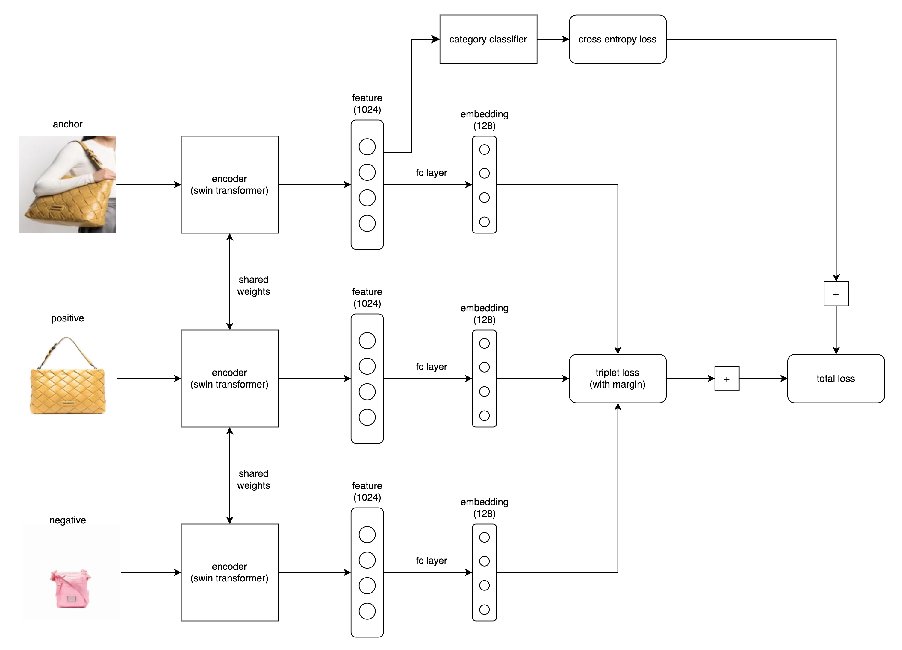

<br>

# 3. 모델 사용법

### 1) 객체 탐지

```python
from PIL import Image
import torch
from transformers import  AutoImageProcessor, AutoModelForObjectDetection

ckpt = './object_detection/model_ckpt'
detector_image_processor = AutoImageProcessor.from_pretrained(ckpt)
detector = AutoModelForObjectDetection.from_pretrained(ckpt).to(device)

image = Image.open('<path/to/image>').convert('RGB')

with torch.no_grad():
    inputs = detector_image_processor(images=[image], return_tensors="pt")
    outputs = detector(**inputs.to(device))
    target_sizes = torch.tensor([[image.size[1], image.size[0]]])
    results = detector_image_processor.post_process_object_detection(outputs, threshold=0.4, target_sizes=target_sizes)[0]

    items = []
    for score, label, box in zip(results["scores"], results["labels"], results["boxes"]):
        score = score.item()
        label = label.item()
        box = [i.item() for i in box]
        print(f"{detector.config.id2label[label]}: {round(score, 3)} at {box}")
        items.append((score, label, box))
```

### 2) 이미지 인코더

```python
from PIL import Image
import torch
import torch.nn as nn
import torchvision.transforms as v2
from transformers import AutoImageProcessor, AutoModel, AutoConfig

labels = ['bag', 'bottom', 'dress', 'hat', 'shoes', 'outer', 'top']

ckpt = "microsoft/swin-base-patch4-window7-224"
config = AutoConfig.from_pretrained(ckpt)
image_processor = AutoImageProcessor.from_pretrained(ckpt)

class ImageEncoder(nn.Module):
    def __init__(self, num_labels):
        super(ImageEncoder, self).__init__()
        self.encoder = AutoModel.from_pretrained(ckpt)
        self.embedding_layer = nn.Linear(config.hidden_size, 128)
        self.category_layer = nn.Linear(config.hidden_size, num_labels)

    def forward(self, image_tensor):
        features = self.encoder(image_tensor).pooler_output
        embeddings = self.embedding_layer(features)

        return embeddings

encoder_model_save_dir = "./image_encoder/model_ckpt"
encoder = ImageEncoder(num_labels=len(labels)).to(device)
encoder.load_state_dict(torch.load(f"{encoder_model_save_dir}/image_encoder.pt"))

transform = v2.Compose([
    v2.Resize((224, 224)),
    v2.ToTensor(),
    v2.Normalize(mean=image_processor.image_mean, std=image_processor.image_std),
])

image = Image.open('<path/to/image>').convert('RGB')
image = transform(image)
with torch.no_grad():
    embedding = encoder(image.unsqueeze(0).to(device)).cpu().numpy()
```

<br>

# 4. 결과

각 카테고리당 kream 썸네일 이미지 약 7000~8000개를 크롤링. 쿼리 이미지는 kream의 스타일 이미지 6개를 선택. 크림 썸네일을 대상으로 한 이유는 검색 페이지 리스트에서 쉽게 크롤링만으로 noise 없는 썸네일을 모을 수 있기 때문.

> ! 만약 썸네일이 모델 착샷이거나 깔끔하지 않은 서비스의 경우 상품 카탈로그의 대표 이미지 등의 노이즈 없는 깔끔한 임베딩용 이미지를 따로 관리 하는 것이 좋을 것임.

거리 계산은 학습때와 동일하게 L2 유사도 적용.

객체 탐지부터 임베딩 계산, 유사 이미지 검색 전체 process는 [search_notebook.ipynb](./search_notebook.ipynb)에서 확인 가능.

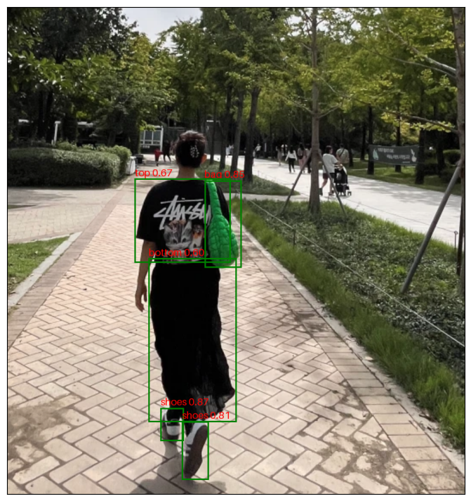
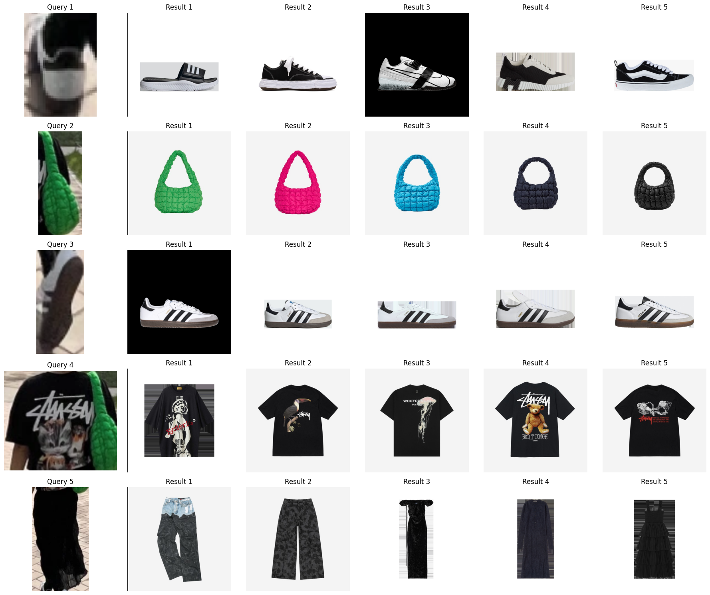
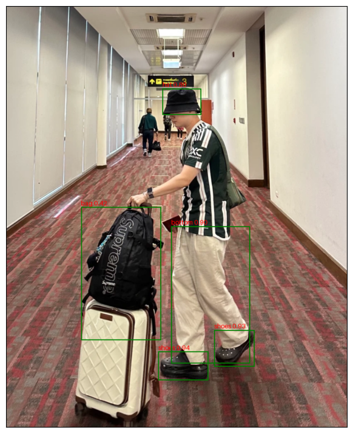
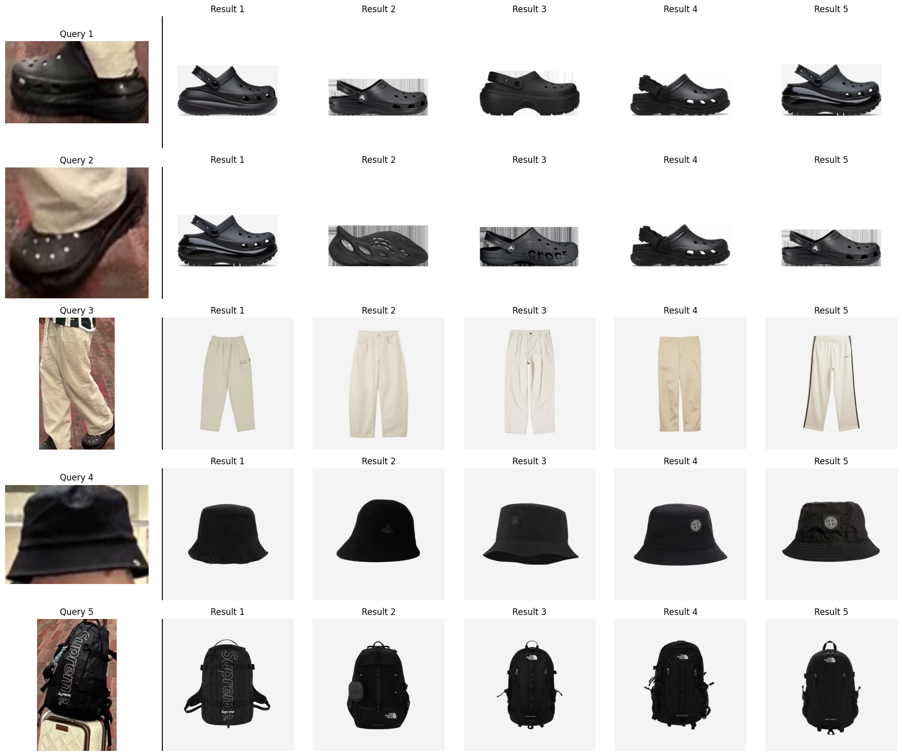
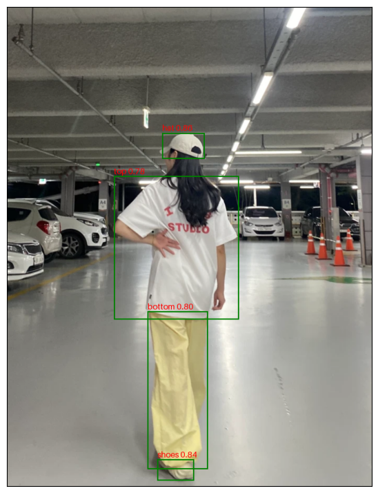
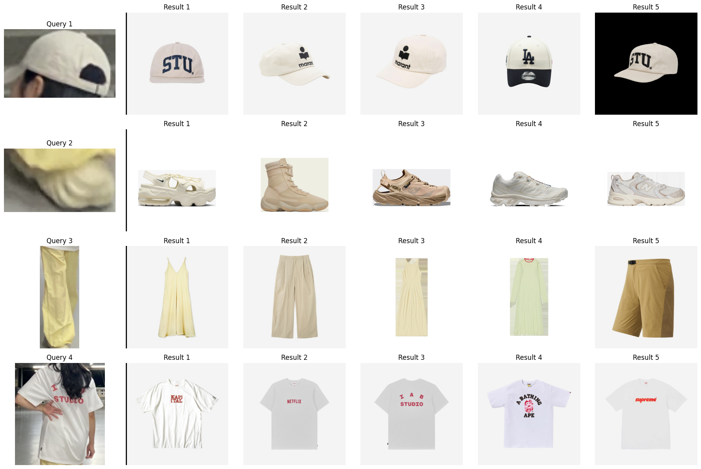
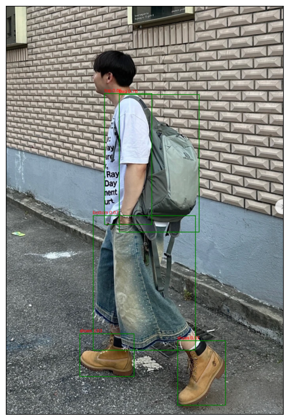
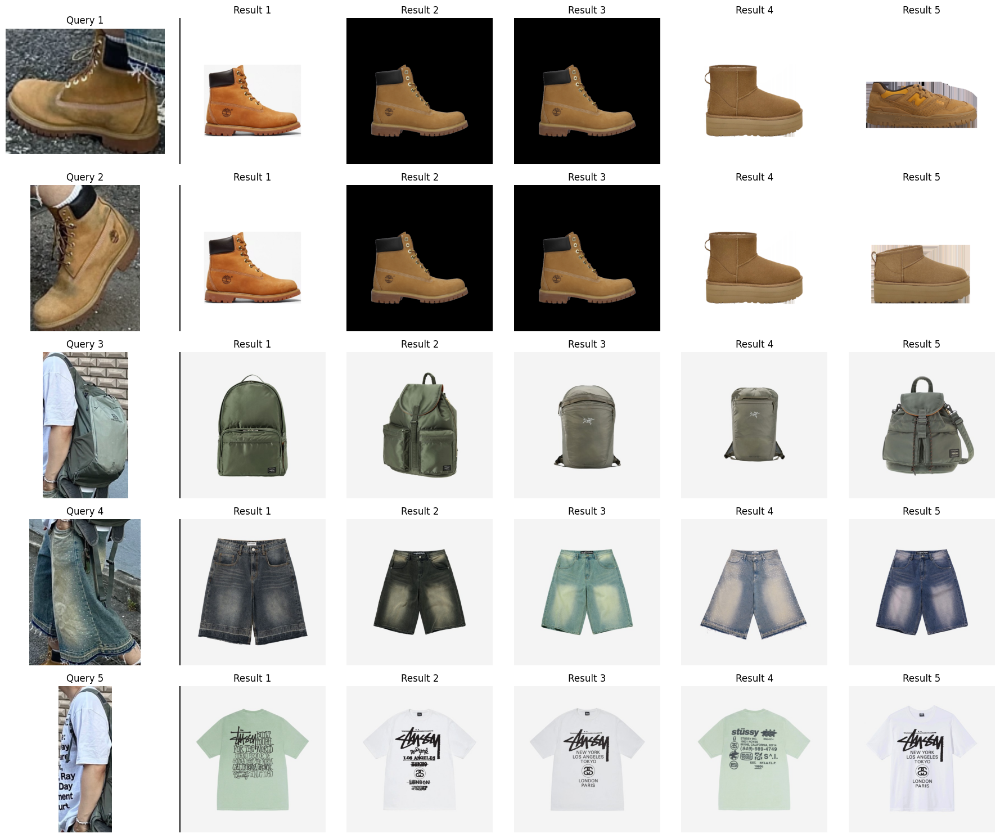
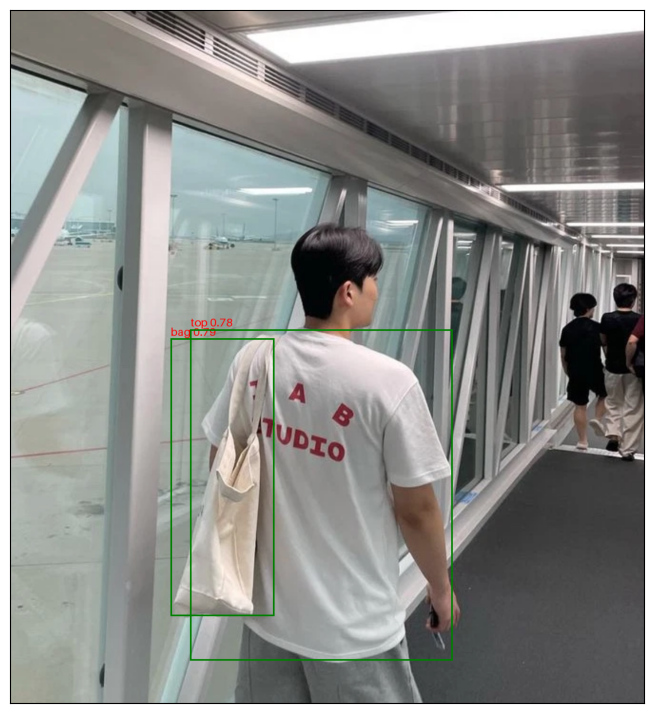
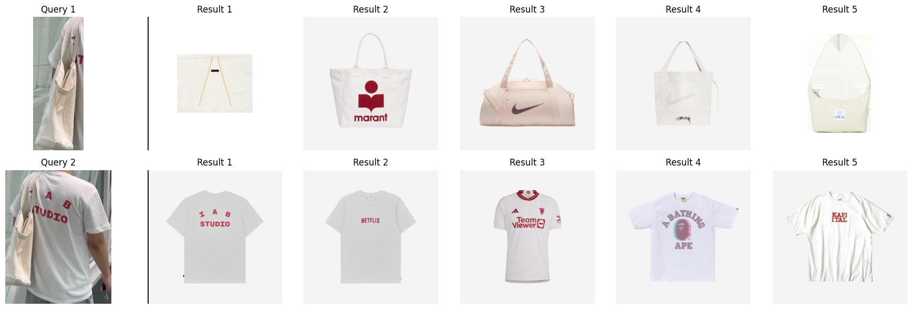
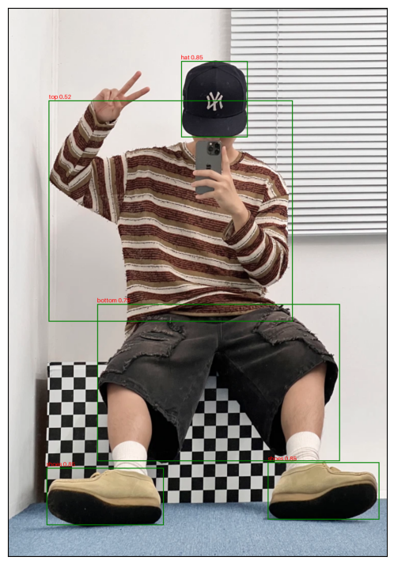
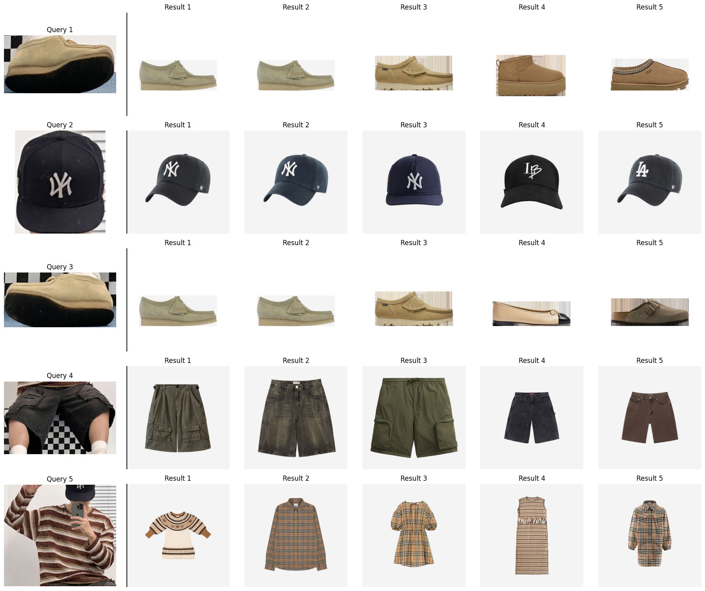

<br>

# 5. 한계 및 개선점

**1. 카테고리별 모델 훈련**

카테고리별로 모델을 훈련하면, 임베딩 계산에서 swin transformer가 어떤 부분에 더 집중해야하는지 잘 학습하게되어 품질이 향상됨.(여기서는 GPU 클라우드 비용 문제로 카테고리 구분 없는 1개의 모델만 훈련시켰음). 실제로 예시를 보면 특징(로고, 글자)등의 특징이 없는 아우터에 대한 검색 품질이 떨어짐을 확인할 수 있음.

**2. 후처리**

객체탐지 단계에서 상품의 카테고리도 같이 예측하기때문에, vector db를 활용하면 이런 카테고리 정보로 필터를 한 대상에 대해서만 이미지 검색을 하여 품질을 높일 수 있다.

**3. 데이터셋 정제**

데이터셋을 만들기 위해 객체탐지 모델과 카테고리 분류기 모델을 활용하는 자동 라벨링 단계를 거쳤음. 어느정도 사람의 노력으로 잘못된 데이터를 제거해주는 단계를 거치면 모델 품질이 약간은 향상될 여지가 있다고 생각된다.

**4. 객체 탐지 모델 훈련용 데이터셋 다양화**

객체탐지 모델 훈련에 사용된 이미지에는 대부분 사람이 있고, 전신의 상당부분이 나오는 이미지 위주이다. 따라서 상품만 단독으로 있는 이미지의 경우 객체 탐지가 잘 안되는 경향이 있다. 이런 데이터는 수동으로 모으는 방법 말고는 당장 떠오르질 않는다.
