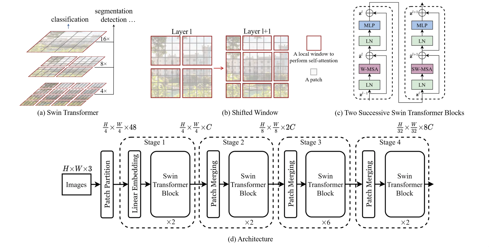
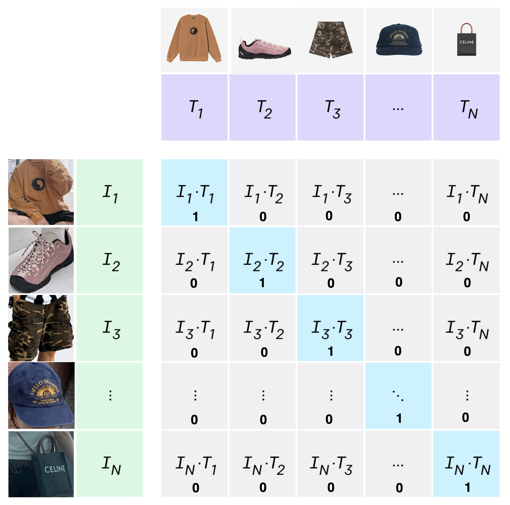
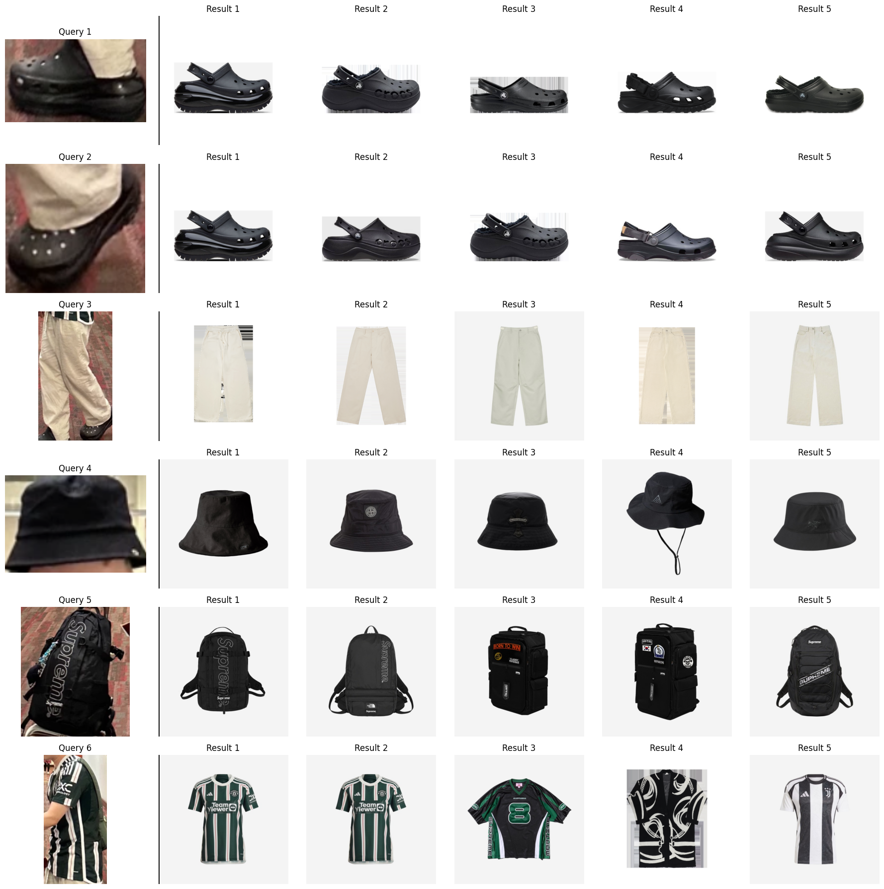
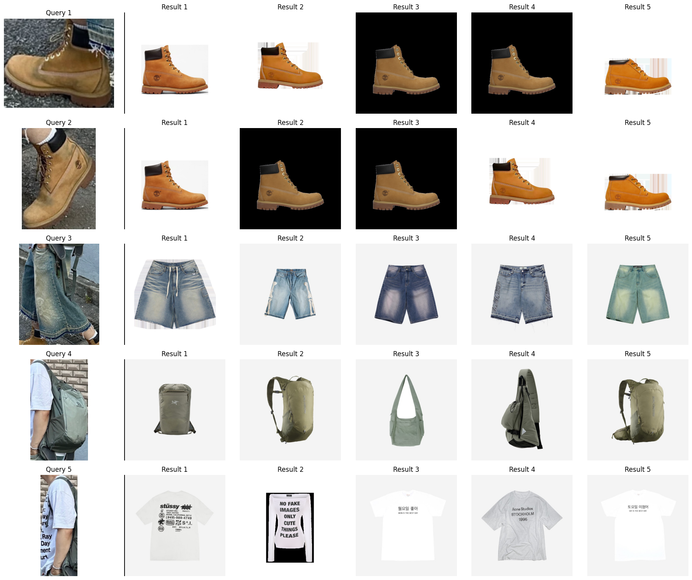
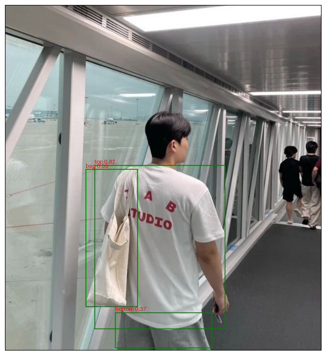
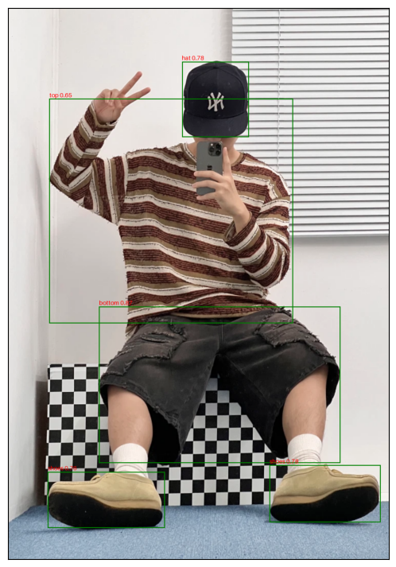
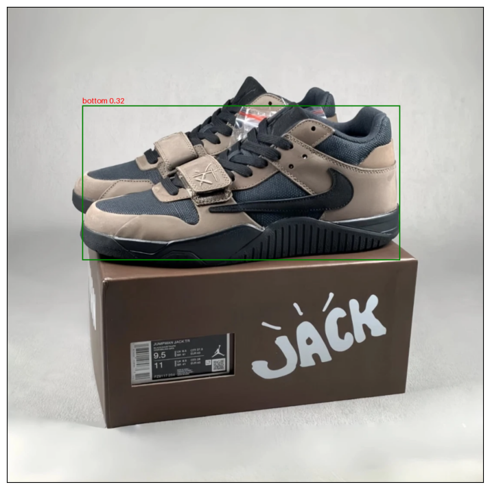
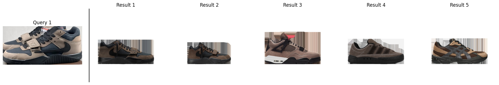
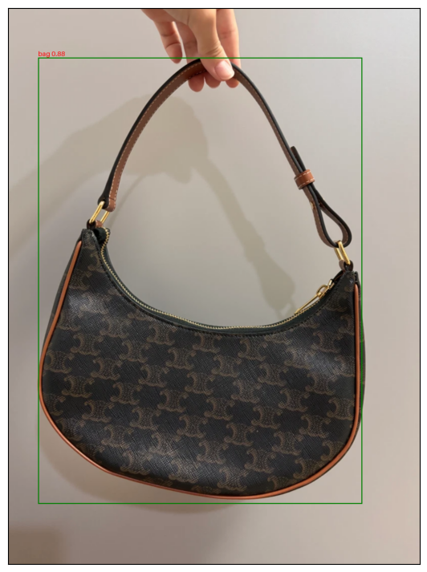
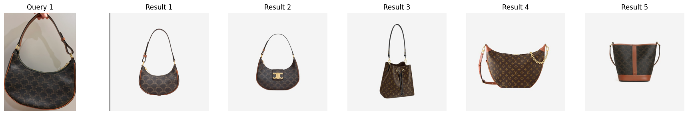

This project is for image-to-image search in the fashion domain. Unlike general similar image search, two components are needed: the ability to detect fashion items in images and extract embeddings from the detected fashion items (in fact, an additional model is needed for automatic training data labeling). In general image similarity search, some level of performance can be achieved using pre-trained open-source models in general domains. However, in the fashion domain, fine-tuning is essential, but this is challenging due to the lack of datasets. This project describes the networks and methods related to training object detection and embedding extraction models, as well as how the datasets were collected. The training data collection/preprocessing/labeling phase accounts for over 90% of the task. The goal is not to remain at the level of a simple toy project, but to create trained models that can be immediately used in typical online fashion commerce (of course, since product thumbnail characteristics and user query image formats may vary by service, it's best to train service-optimized models by constructing optimized datasets).

# 1. Training dataset

### 1) Object Detection

- [modanet](https://github.com/eBay/modanet)

  Dataset for object detection model fine-tuning. Categories were consolidated into 7 classes: bag, bottom, dress, hat, outer, shoes, and top to improve performance.

- [fashionpedia](https://fashionpedia.github.io/home/)

  Dataset for object detection model fine-tuning. Similarly, categories were consolidated into 7 classes: bag, bottom, dress, hat, outer, shoes, and top.


### 2) Image Encoder(Feature Extraction)

User posting images from [onthelook](https://onthelook.co.kr/) and [kream](https://kream.co.kr) were crawled and preprocessed. First, raw data of image-product thumbnail combinations from posts were collected. Then, object detection was performed on posting images, and category classification was performed on product thumbnails to pair images of the same category together. For thumbnail category classification, a trained category classifier was used.
Finally, about 290,000 anchor-positive image pairs were created for 6 categories: tops, bottoms, outer, shoes, bags, and hats.

Finally, approximately 290,000 anchor-positive image pairs were created for 6 categories: tops, bottoms, outer, shoes, bags, and hats.


</br>

> Additionally, there are public datasets like [deepfasion2](https://github.com/switchablenorms/DeepFashion2), [k-fashion](https://github.com/K-COORD/K-Fashion) dataset, and [fashion anchor cloth pairs](https://www.kaggle.com/datasets/kritanjalijain/fashion-anchor-cloth-pairs), but they couldn't be used due to limitations such as having too few category types, or containing noise-free images taken in studios which create a gap with reality.

<br>

# 2. Model architecture & Training

### 1) Object Detection

[microsoft/conditional-detr-resnet-50](https://huggingface.co/microsoft/conditional-detr-resnet-50)
Object detection is one of the representative image tasks in the vision field, with quite standardized dataset formats. Simply referring to the task guide provided by huggingface is sufficient for easy training/inference.



### 2) Image Encoder(Feature Extraction)

I used [microsoft/swin-base-patch4-window7-224](https://huggingface.co/microsoft/swin-base-patch4-window7-224) for base image encoder model. Just added a 128 size fully connected layer to lower embedding size.
The dataset used anchor (product areas detected from posts) - positive (product thumbnail) image pairs. Within each batch, all samples except one's own positive were used as negative samples, training to minimize the distance between anchor-positive pairs while maximizing the distance between anchor-negative pairs. This method is known as contrastive learning, which is the training method used by OpenAI's CLIP model.
Initially, anchor - positive - negative pairs were explicitly constructed in a 1:1:1 ratio using triplet loss, but training with in-batch negative sampling and contrastive loss showed much better performance as it allowed learning from more negative samples.



<br>

# 3. Sample code for usage

### 1) Object Detection

```python
from PIL import Image
import torch
from transformers import  AutoImageProcessor, AutoModelForObjectDetection

device = torch.device('cuda') if torch.cuda.is_available() else torch.device('cpu')

ckpt = 'yainage90/fashion-object-detection'
detector_image_processor = AutoImageProcessor.from_pretrained(ckpt)
detector = AutoModelForObjectDetection.from_pretrained(ckpt).to(device)

image = Image.open('<path/to/image>').convert('RGB')

with torch.no_grad():
    inputs = detector_image_processor(images=[image], return_tensors="pt")
    outputs = detector(**inputs.to(device))
    target_sizes = torch.tensor([[image.size[1], image.size[0]]])
    results = detector_image_processor.post_process_object_detection(outputs, threshold=0.4, target_sizes=target_sizes)[0]

    items = []
    for score, label, box in zip(results["scores"], results["labels"], results["boxes"]):
        score = score.item()
        label = label.item()
        box = [i.item() for i in box]
        print(f"{detector.config.id2label[label]}: {round(score, 3)} at {box}")
        items.append((score, label, box))
```

### 2) Image Encoder

```python
from PIL import Image
import torch
import torch.nn as nn
import torch.nn.functional as F
import torchvision.transforms as v2
from transformers import AutoImageProcessor, SwinModel, SwinConfig
from huggingface_hub import PyTorchModelHubMixin

device = torch.device('cuda') if torch.cuda.is_available() else torch.device('cpu')

ckpt = "yainage90/fashion-image-feature-extractor"
encoder_config = SwinConfig.from_pretrained(ckpt)
encoder_image_processor = AutoImageProcessor.from_pretrained(ckpt)

class ImageEncoder(nn.Module, PyTorchModelHubMixin):
    def __init__(self):
        super(ImageEncoder, self).__init__()
        self.swin = SwinModel(config=encoder_config)
        self.embedding_layer = nn.Linear(encoder_config.hidden_size, 128)

    def forward(self, image_tensor):
        features = self.swin(image_tensor).pooler_output
        embeddings = self.embedding_layer(features)
        embeddings = F.normalize(embeddings, p=2, dim=1)

        return embeddings

encoder = ImageEncoder().from_pretrained('yainage90/fashion-image-feature-extractor').to(device)

transform = v2.Compose([
    v2.Resize((encoder_config.image_size, encoder_config.image_size)),
    v2.ToTensor(),
    v2.Normalize(mean=encoder_image_processor.image_mean, std=encoder_image_processor.image_std),
])

image = Image.open('<path/to/image>').convert('RGB')
image = transform(image)
with torch.no_grad():
    embedding = encoder(image.unsqueeze(0).to(device)).cpu().numpy()
```

<br>

# 4. Experiments

I used approximately 15,000 KREAM thumbnail images per category as search target images. 9 style images from KREAM were selected as query images.

> ! For services where thumbnails are model shots or not clean, it would be better to separately manage noise-free, clean images for embedding purposes, such as representative images from product catalogs.

Note [search_notebook.ipynb](./search_notebook.ipynb) for more details.
















<br>
