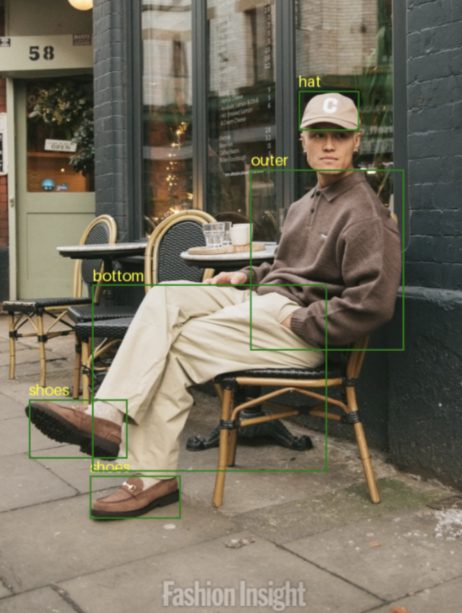
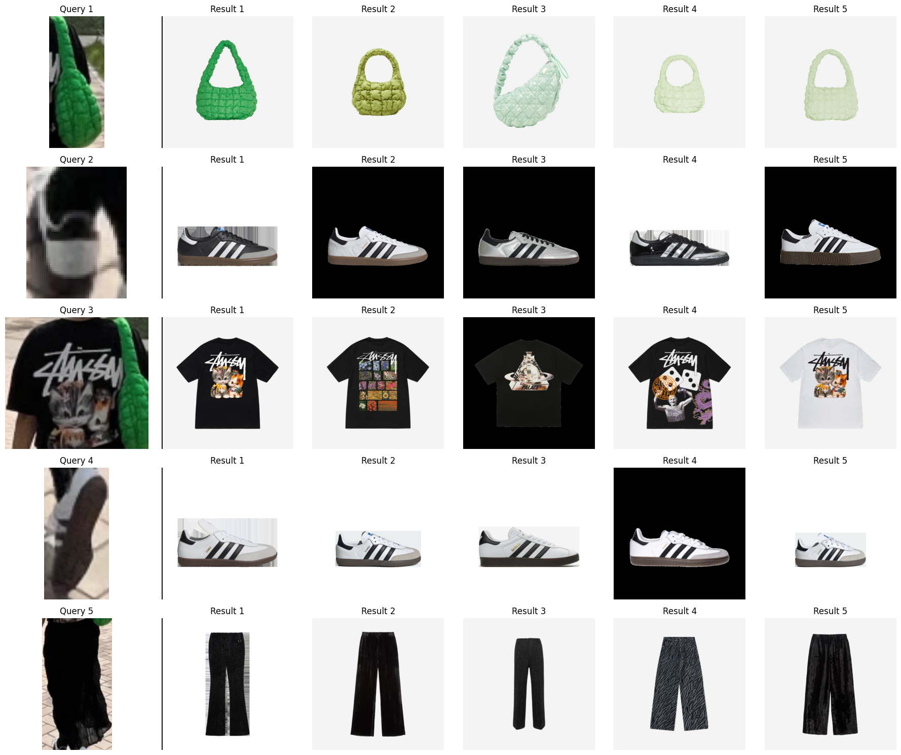
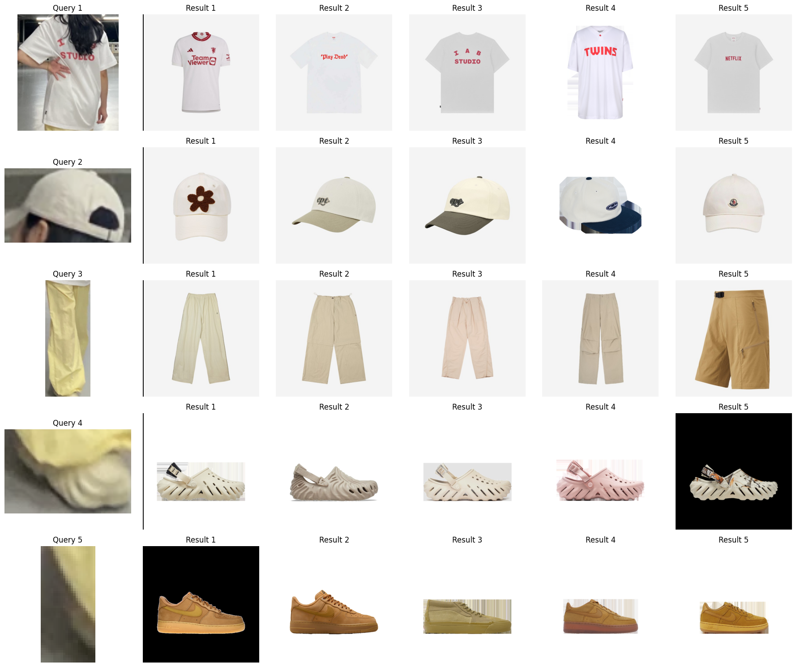
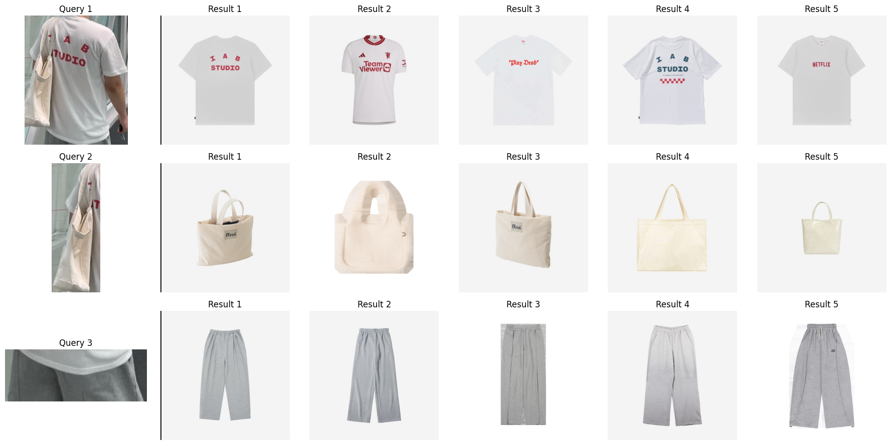
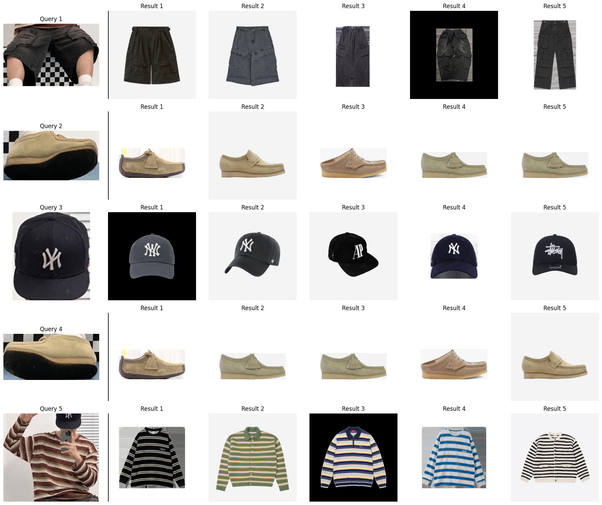
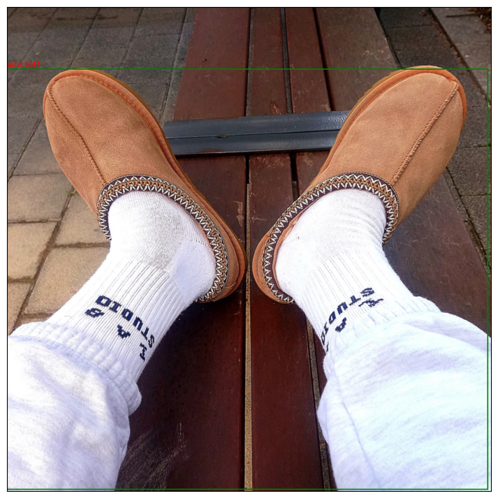

이 프로젝트는 패션 도메인에서 이미지-이미지 검색을 위한 것이다. 일반적인 유사 이미지 검색과 다르게, 이미지에서 패션 아이템을 탐지하는 기능과 탐지된 패션 아이템의 임베딩을 추출해야 하는 부분 두 가지가 필요하다(사실 학습 데이터 자동 라벨링을 위한 모델도 추가적으로 필요). 보통의 유사 이미지 검색은 일반적인 도메인에서 사전학습된 오픈소스 모델로도 어느정도의 성과 달성이 가능하다. 그러나 패션 도메인에서는 파인튜닝이 필수적인데, 데이터셋의 부족으로 쉽지 않다. 이 프로젝트에서는 객체 탐지 및 임베딩 추출 모델을 학습시키는 네트워크 및 방법에 관련된 내용과 데이터셋을 수집한 방법에 대해 기술한다. 훈련 데이터 수집/전처리/라벨링 단계가 task의 90% 이상을 차지한다. 단순 토이 프로젝트 수준에서 그치지 않고 통상적인 온라인 패션 커머스에서 바로 사용 가능한 수준의 훈련된 모델을 만드는 것이 목표다.(물론 서비스별로 상품 썸네일 특성, 유저의 쿼리 이미지 형태가 다를 수 있으므로 최적화된 데이터셋을 구성하여 서비스에 최적화 된 모델을 훈련하는 것이 최선이다.)

# 1. 훈련 데이터

### 1) 객체 탐지(object detection)

- [modanet](https://github.com/eBay/modanet)

  객체 탐지 모델 파인튜닝을 위한 데이터셋. 성능을 위해 카테고리를 bag, bottom, dress, hat, outer, shoes, top 7개로 통합.

- [fashionpedia](https://fashionpedia.github.io/home/)

  객체 탐지 모델 파인튜닝을 위한 데이터셋. 마찬가지로 카테고리를 bag, bottom, dress, hat, outer, shoes, top 7개로 통합.



### 2) 이미지 인코더

[onthelook](https://onthelook.co.kr/), [kream](https://kream.co.kr)의 유저 포스팅 이미지를 크롤링, 전처리를 했다. 포스팅에서 이미지 - 상품 썸네일 조합의 raw 데이터를 먼저 수집하였다. 이후 포스팅 이미지에 대해 객체탐지를 수행하고 상품 썸네일에 대해 카테고리 분류를 수행하여 같은 카테고리끼리 이미지 쌍으로 묶었다. 썸네일의 카테고리 분류는 따로 학습시킨 카테고리 분류기를 사용.

최종적으로 상의, 하의, 아우터, 신발, 가방, 모자 6개 카테고리에 대해 약 29만 anchor-positive 이미지 쌍을 만들었음.


</br>

> 추가로 [deepfasion2](https://github.com/switchablenorms/DeepFashion2), [k-fashion 데이터](https://github.com/K-COORD/K-Fashion), [fashion anchor cloth pairs](https://www.kaggle.com/datasets/kritanjalijain/fashion-anchor-cloth-pairs) 같은 공개된 데이터셋도 있지만 카테고리 종류가 별로 없거나, 스튜디오 에서 찍은 노이즈 없는 이미지라 현실과의 괴리가 있거나 하는 등의 부족함이 있어 사용하지 못했다.

<br>

# 2. 모델 및 학습

### 1) 객체 탐지

[microsoft/conditional-detr-resnet-50](https://huggingface.co/microsoft/conditional-detr-resnet-50)
객체 탐지는 vision 분야의 대표적인 이미지 task 중 하나로 데이터셋 포맷이 꽤 정형화 되어 있음. huggingface에서 제공하는 task guide만 참고하여도 충분히 쉽게 학습/추론이 가능하다.


### 2) 이미지 인코더

encoder는 [microsoft/swin-base-patch4-window7-224](https://huggingface.co/microsoft/swin-base-patch4-window7-224)를 사용하였다.
데이터셋은 anchor(포스팅에서 탐지된 상품 영역) - positive(상품 썸네일) 이미지 쌍을 사용하였다. 그리고 batch 내에서 자신의 positive 이외에는 모두 negtive 샘플로 사용하여 anchor-positive 사이 거리는 가까워지게, anchor-negative 사이 거리는 멀어지게 학습하였다. 이 방식은 OpenAI의 CLIP모델의 학습방법으로 알려진 contrastive learning 방식이다.
처음에는 명시적으로 anchor - positive - negative 쌍을 1:1:1 비율로 구성하고 triplet loss를 사용했으나, 이보다는 in-batch negative 샘플링과 함께 contrastive loss 방식으로 학습시킬 경우 더 많은 negative 샘플을 학습할 수 있어 성능이 훨씬 향상되었음.


<br>

# 3. 모델 사용법

### 1) Object Detection

```python
from PIL import Image
import torch
from transformers import  AutoImageProcessor, AutoModelForObjectDetection

device = torch.device('cuda') if torch.cuda.is_available() else torch.device('cpu')

ckpt = 'yainage90/fashion-object-detection'
detector_image_processor = AutoImageProcessor.from_pretrained(ckpt)
detector = AutoModelForObjectDetection.from_pretrained(ckpt).to(device)

image = Image.open('<path/to/image>').convert('RGB')

with torch.no_grad():
    inputs = detector_image_processor(images=[image], return_tensors="pt")
    outputs = detector(**inputs.to(device))
    target_sizes = torch.tensor([[image.size[1], image.size[0]]])
    results = detector_image_processor.post_process_object_detection(outputs, threshold=0.4, target_sizes=target_sizes)[0]

    items = []
    for score, label, box in zip(results["scores"], results["labels"], results["boxes"]):
        score = score.item()
        label = label.item()
        box = [i.item() for i in box]
        print(f"{detector.config.id2label[label]}: {round(score, 3)} at {box}")
        items.append((score, label, box))
```

### 2) Image Encoder

```python
from PIL import Image
import torch
import torch.nn as nn
import torch.nn.functional as F
import torchvision.transforms as v2
from transformers import AutoImageProcessor, SwinModel, SwinConfig
from huggingface_hub import PyTorchModelHubMixin

device = torch.device('cuda') if torch.cuda.is_available() else torch.device('cpu')

ckpt = "yainage90/fashion-image-feature-extractor"
encoder_config = SwinConfig.from_pretrained(ckpt)
encoder_image_processor = AutoImageProcessor.from_pretrained(ckpt)

class ImageEncoder(nn.Module, PyTorchModelHubMixin):
    def __init__(self):
        super(ImageEncoder, self).__init__()
        self.swin = SwinModel(config=encoder_config)
        self.embedding_layer = nn.Linear(encoder_config.hidden_size, 128)

    def forward(self, image_tensor):
        features = self.swin(image_tensor).pooler_output
        embeddings = self.embedding_layer(features)
        embeddings = F.normalize(embeddings, p=2, dim=1)

        return embeddings

encoder = ImageEncoder().from_pretrained('yainage90/fashion-image-feature-extractor').to(device)

transform = v2.Compose([
    v2.Resize((encoder_config.image_size, encoder_config.image_size)),
    v2.ToTensor(),
    v2.Normalize(mean=encoder_image_processor.image_mean, std=encoder_image_processor.image_std),
])

image = Image.open('<path/to/image>').convert('RGB')
image = transform(image)
with torch.no_grad():
    embedding = encoder(image.unsqueeze(0).to(device)).cpu().numpy()
```

<br>

# 4. 결과

각 카테고리당 kream 썸네일 이미지 약 7000~8000개를 크롤링. 쿼리 이미지는 kream의 스타일 이미지 6개를 선택. 크림 썸네일을 대상으로 한 이유는 검색 페이지 리스트에서 쉽게 크롤링만으로 noise 없는 썸네일을 모을 수 있기 때문.

> ! 만약 썸네일이 모델 착샷이거나 깔끔하지 않은 서비스의 경우 상품 카탈로그의 대표 이미지 등의 노이즈 없는 깔끔한 임베딩용 이미지를 따로 관리 하는 것이 좋을 것임.

거리 계산은 학습때와 동일하게 normalized L2 유사도(=코사인 유사도) 적용.

객체 탐지부터 임베딩 계산, 유사 이미지 검색 전체 process는 [search_notebook.ipynb](./search_notebook.ipynb)에서 확인 가능.














<br>

# 5. 한계 및 개선점

**1. 카테고리별 모델 훈련**

카테고리별로 모델을 훈련하면, 임베딩 계산에서 swin transformer가 어떤 부분에 더 집중해야하는지 잘 학습하게되어 품질이 향상됨.(여기서는 GPU 클라우드 비용 문제로 카테고리 구분 없는 1개의 모델만 훈련시켰음). 실제로 예시를 보면 특징(로고, 글자)등의 특징이 없는 아우터에 대한 검색 품질이 떨어짐을 확인할 수 있음.

**2. 후처리**

객체탐지 단계에서 상품의 카테고리도 같이 예측하기때문에, vector db를 활용하면 이런 카테고리 정보로 필터를 한 대상에 대해서만 이미지 검색을 하여 품질을 높일 수 있다.

**3. 데이터셋 정제**

데이터셋을 만들기 위해 객체탐지 모델과 카테고리 분류기 모델을 활용하는 자동 라벨링 단계를 거쳤음. 어느정도 사람의 노력으로 잘못된 데이터를 제거해주는 단계를 거치면 모델 품질이 약간은 향상될 여지가 있다고 생각된다.

**4. 객체 탐지 모델 훈련용 데이터셋 다양화**

객체탐지 모델 훈련에 사용된 이미지에는 대부분 사람이 있고, 전신의 상당부분이 나오는 이미지 위주이다. 따라서 상품만 단독으로 있는 이미지의 경우 객체 탐지가 잘 안되는 경향이 있다. 이런 데이터는 수동으로 모으는 방법 말고는 당장 떠오르질 않는다.
